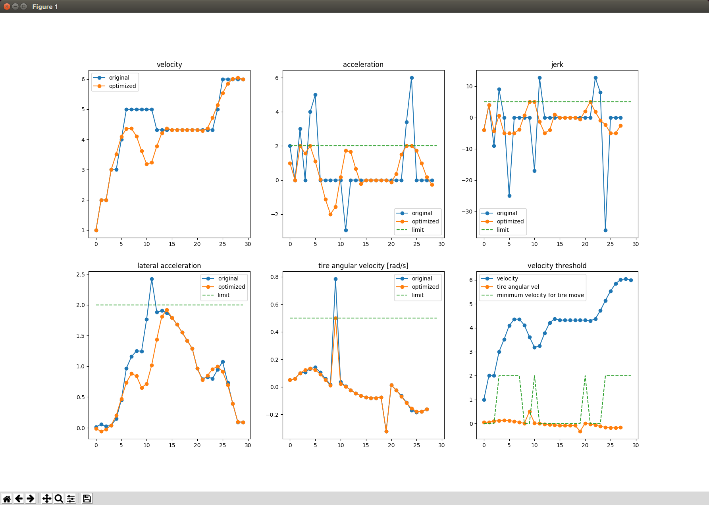

# qp_speed_planning
Recalculate the speed to satisfy the constraint condition with python.The recursive convex optimization is used. The objective function is the square error with the original speed.

## Note
The velocity must be positive

## constraint
- max velocity [m/s]
- max acceleration (1d-approximate) [m/s2]
- max jerk (1d-approximate) [m/s3]
- max lateral acceleration [m/s2]
- max steering(tire) angular velocity [rad/s]
- min velocity while tire is rotating [m/s] : if this value is larger than zero, the vehicvle does not stop when tier is moving

## result
